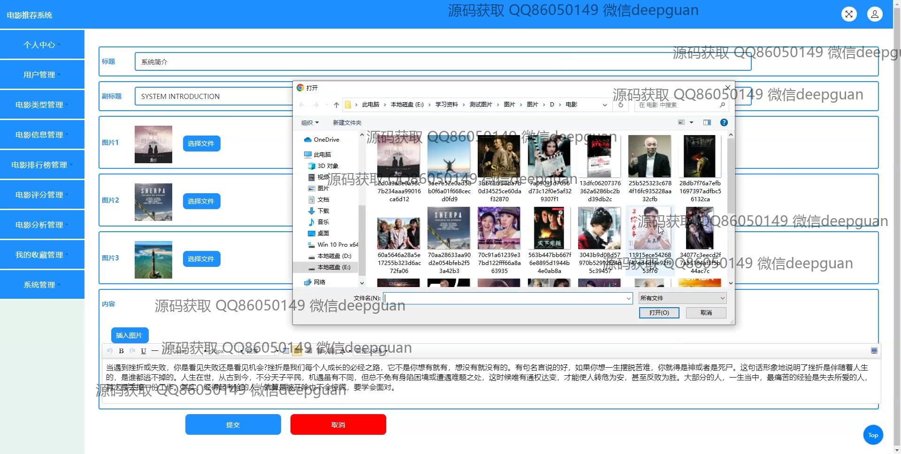

<h1 align="center">电影推荐系统</h1>

## 简介
电影推荐系统：角色分为管理员和用户；功能包括用户管理、电影信息管理、电影推荐与评分、个性化推荐、评论功能和搜索筛选；支持用户注册登录、电影上传及编辑、个性化观影体验。    --计算机毕业设计源码；毕设源码；java毕业设计源码

## 联系方式

<h3 align="center">获取完整代码与数据库文件 + 微信：deepguan QQ: 86050149 QQ群: 783742310</h3>

<h3 align="center">可帮忙远程部署 包运行成功！提供远程部署、修改代码、设计文档指导、代码讲解等服务！</h3>

## 功能介绍（完整见运行截图）
管理员：基本功能包括用户和电影信息的添加、修改和删除，用户注册和登录的管理，电影类别和排行的维护。后台管理功能涵盖个人中心、用户管理、类别管理、影片信息和排行榜等，支持影片数据的录入与编辑，包括海报上传、评分和评论管理，并提供电影系统化推荐和数据分析功能，以优化系统内容和用户体验。

用户：通过账号注册和登录后，可以浏览个性化推荐的电影列表，进行关键词搜索与过滤，查看电影详细信息如简介、导演和演员，进行评分及评论以增强推荐效果。用户个人中心便于管理个人信息、收藏和浏览历史，收录与查看喜欢的影片，支持通过首页导航探索不同类型电影，享受智能化观影推荐服务。

## 运行截图

本代码来源于网络,仅供学习参考使用!

